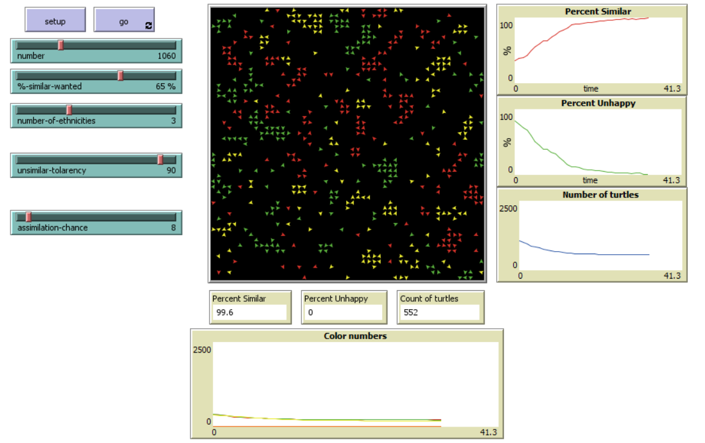

## Комп'ютерні системи імітаційного моделювання
## СПм-22-3, **Зайцев Дмитро Ярославович**
### Лабораторна робота №**2**. Редагування імітаційних моделей у середовищі NetLogo

 

### Варіант 8, модель у середовищі NetLogo:
[Segregation Simple Extension 1](http://www.netlogoweb.org/launch#http://www.netlogoweb.org/assets/modelslib/IABM%20Textbook/chapter%203/Segregation%20Extensions/Segregation%20Simple%20Extension%201.nlogo)

 

### Внесені зміни у вихідну логіку моделі, за варіантом:

*Завдання: Додати можливість агенту зникнути, вірогідність чого залежить від кількості наявних поряд з ним "чужих" і кількості представників їхньої групи у їх власному оточенні. Виводити графік зміни розміру популяції.*

**Функція визначення відсотку "своїх" та "чужих"** винесена окремо, бо вона була використана двічі, і в ній має бути урахування ділення на 0:
<pre>
to-report calculatePercentage [number1 number2]
  ifelse number2 != 0 [
    report (number1 / number2) * 100
  ] [
    report 0
  ]
end
</pre>

**Відсоток "своїх" сусідів** обчислюється з використанням створеної функції та вже існуючих змінних:
<pre>
let %-similar calculatePercentage similar-nearby total-nearby
</pre>

**Кількість "чужих" сусідів** обраховується також з використання вже існуючих змінних:
<pre>
let unsimilar-nearby total-nearby - similar-nearby
</pre>

**Відсоток "чужих" сусідів** отримується за вже знайомою логікою:
<pre>
let %-unsimilar calculatePercentage unsimilar-nearby total-nearby
</pre>

Тепер, з готовими до використання відсотками "своїх" та "чужих" визначається значення для змінної **lonely?**, що по суті зберігає чи "своїх" сусідів менше ніж "чужих":
<pre>
set lonely? %-similar < %-unsimilar
</pre>

**Процедура kill-lonely-turtles** власне вбиває агентів-черепашок зі значенням **lonely?** true та з шансом, що залежить від керуючого параметру unsimilar-tolarency:
<pre>
to kill-lonely-turtles
  ask turtles with [ lonely? ] [
    if random-with-probability (100 - unsimilar-tolarency) [ die ]
  ]
end
</pre>

Використана функція **random-with-probability** також була створена у процесі додавання змін на власний розсуд та використана у сніпеті вище:
<pre>
to-report random-with-probability [probability]
  ifelse probability = 0 [
    report false
  ] [
    let random-number random 101
    report random-number <= probability
  ]
end
</pre>

Викликається процедура **kill-lonely-turtles** у процедурі **go**.

 

### Внесені зміни у вихідну логіку моделі, на власний розсуд:

**Додано можливість агентів-черепашок асимілюватись, тобто змінювати свій колір в залежності від оточення та керуючого параметру *assimilation-chance***.
Для цього визначено кольори всіх черепашок сусідів та записано у list **main-neighbors-colors**, який унікальний для кожної черепашки:
<pre>
set main-neighbors-colors [color] of turtles-on neighbors
</pre>
Таким чином, список міститиме кольори разом з дублікатами, тобто 2 червоних сусіда і один зелений означатимуть, що список матиме 2 кольори red та один green.
А значить з більшою кількістю якогось кольору у списку збільшується імовірність його випадкового отримання.

**Процедура assimilate-unhappy-turtles** змінює колір агентів черепашок які не happy з шансом **assimilation-chance**, що встановлюється юзером:
<pre>
to assimilate-unhappy-turtles
  ask turtles with [ not happy? ] [
    if random-with-probability assimilation-chance
      [ set color (item (random length main-neighbors-colors) main-neighbors-colors) ]
  ]
end
</pre>

Викликається процедура **assimilate-unhappy-turtles** у процедурі **go**.

Фінальний код моделі та її інтерфейс доступні за [посиланням](model.nlogo).
 

## Обчислювальні експерименти
### 1. Вплив асимілятивності черепашок на середню швидкість генерації кінцевого результату
